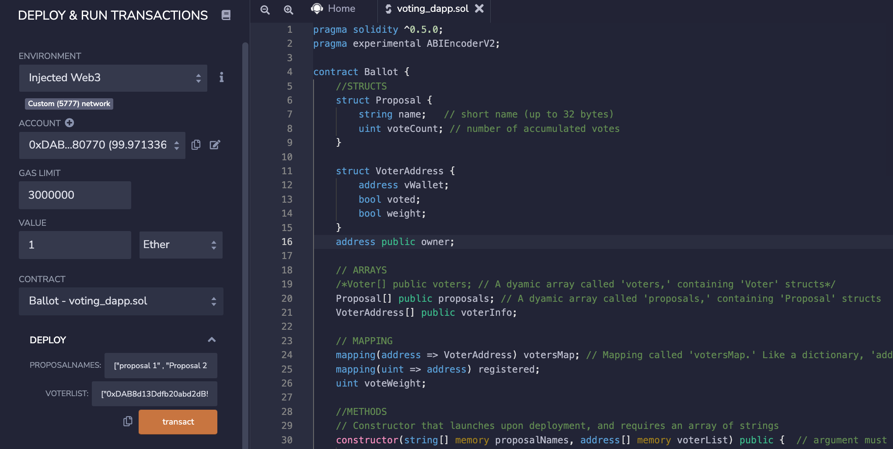
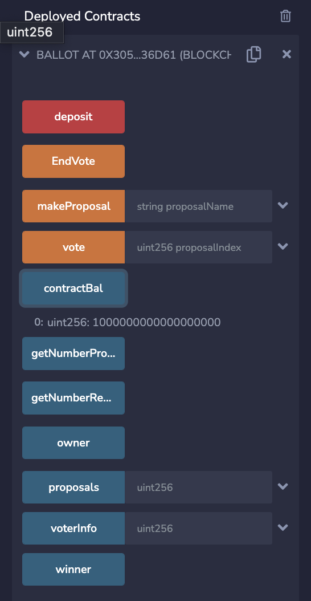
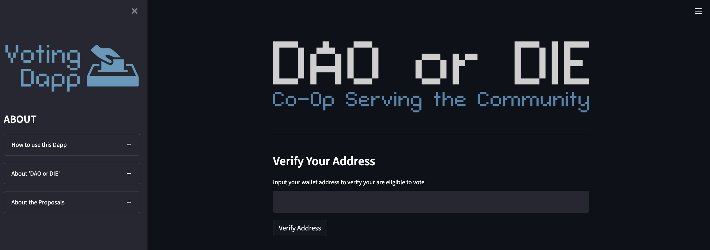
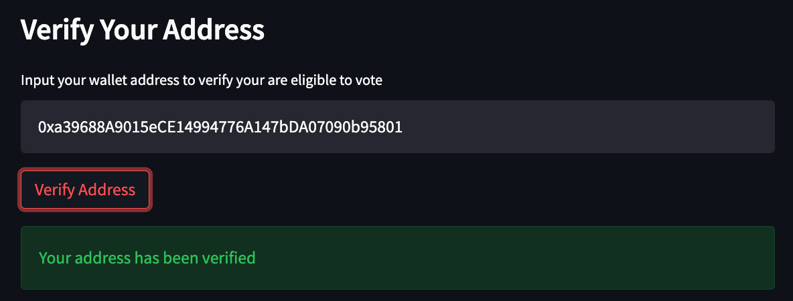
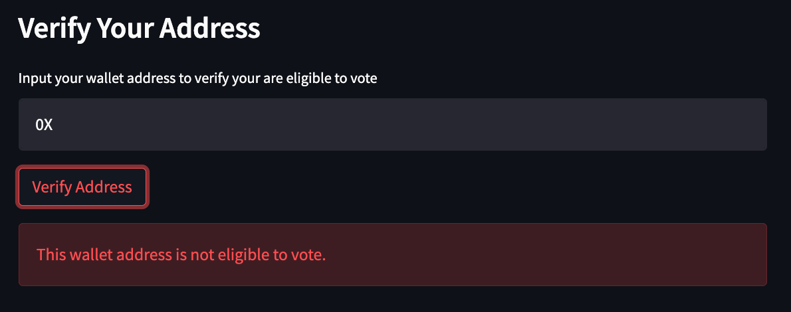
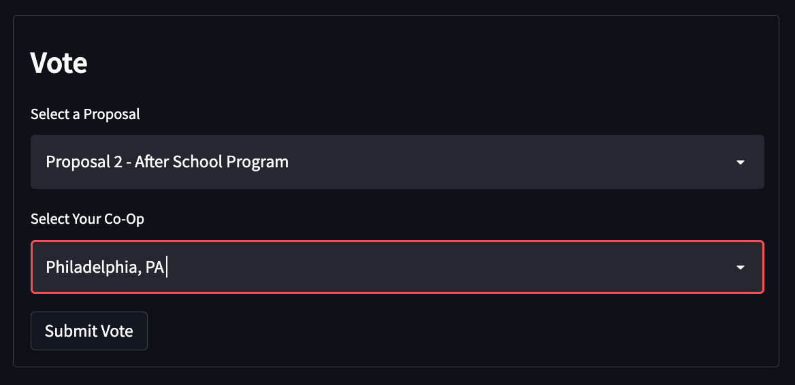
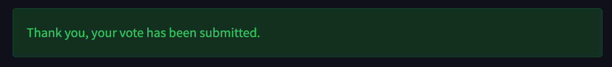
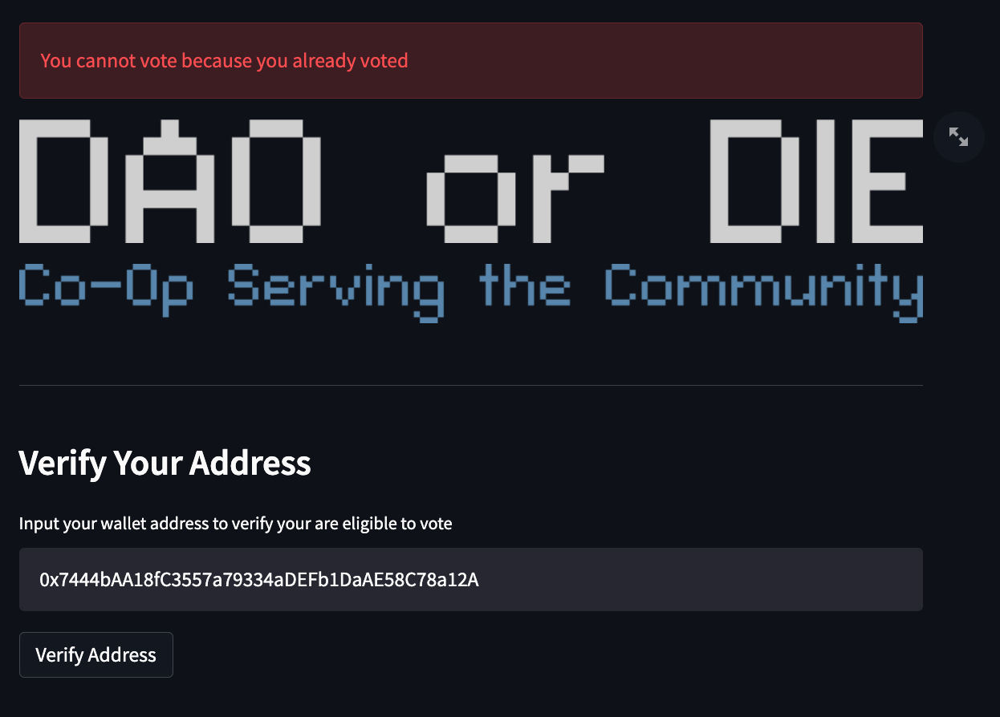
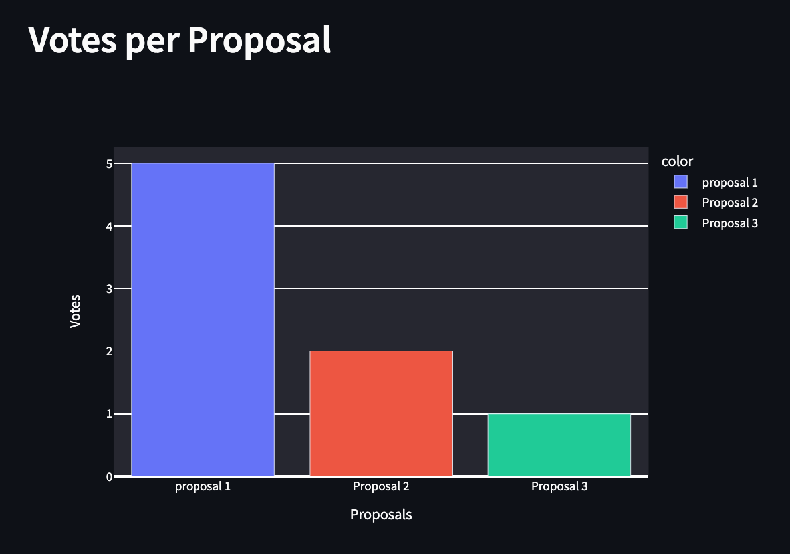

# $Blockchain Ballots$

## $Synapsis$
 Imagine a world in which something so dramatic, say a pandemic, happens and makes it unsafe for people to leave their homes for regular activities?  In important years there is still a need for democratic actions to continue moving forward as a nation, in other words, VOTING!  For everything from union collective bargaining, to local elections, even to presidential elections, voting is a key instrument in improving the world around us.  What has been created and laid out here provides a way for anonymous voting stored within a blockchain that provides security, speed, and confirmation of completion within moments of casting the vote!  

-----

## $Tech Utilized$
 - Solidity
 - Remix IDE
 - Streamlit
 - Geopandas
 - MetaMask
 - Ganache
 - VS Code

-----

 ## $Usage And Installation$

 ### $Installation$
 #### $Remix IDE (Solidity)$
- In your web browser, navigate to [Remix IDE](https://remix.ethereum.org/)
- Create a new document, and code your contract
- Upon completion, in the left menu navigate to the 'Solidity Compiler' and compile your contract
- Then in the left menu navigate to "Deploy & Run Transactions" and deploy your contract
- Scroll down to interact with your contract
 

 #### $Streamlit$
 - Optional: Create a new Web 3 environment (recommended)
 - Pip Intall: [Web 3](https://pypi.org/project/web3/) and [Streamlit]( https://docs.streamlit.io/library/get-started/installation)
 - Clone the 'Blockchain_Ballots' repository 
 - In your terminal, navigate to the folder containing 'app.py' and enter the command 'streamlit run app.py'
 - Streamlit will launch locally in your default browser
 - From there you can interact with the app

 #### $Geopandas$
 - For installation of geopandas, a new environment will likely need to be created witin your operating system.  Once the new environment has been set, be sure to run a pip install of geopandas to have the most up to date version.
 - Once installed, the dataframes will be able to get converted to the geometric location using the jupyter notebook included in the repository and subsequently overlaid with a map of the united states for general location verification

 ### $Usage$
 #### $Remix IDE (Solidity)$
 - Once your contract has been deployed, navigate to "Deploy & Run Transactions".  Scroll to the bottom where you can interact with the various fuctions in the contract.

 #### $Streamlit$
 - Once you're launched your Streamlit app, its very easy to interact with.  You can use it the same way your would a normal website/app.
 #### $Geopandas$
 - Using the Geopandas mapping database is very simple and requires a few steps:
    1. Pulling in the up to date dataframe for the zip codes associated with the votes collected.
    2. Confirmation of the latitude and longitude of those zip codes for reference on the map.
    3. Passing the latitudes and longitudes within the dataframe through the geometric builder to create the exact point within the map.
    4. Overlay the points with the map and show the general locations of where the votes came from to verify regional eligibility of each vote.

 -----

 ## $Procedural Evidence$
 ### $Solidity$

 The contract being deployed on Solidity Remix

 The contract being deployed on Solidity Remix

### $Streamlit$
Main viewing page for the streamlit voting application

Visual confirmation that your address has been verified and you are eligible to vote

Visual confirmation that your address is not eligible to cast a vote

Once deemed eligible to vote, a dashboard will appear asking for your proposal vote, and your local Co-Op

Visual confirmation your vote has been received

Visual confirmation you have already voted, and therefore, cannot vote again

After the vote has been cast, a chart will appear to show current polling results
